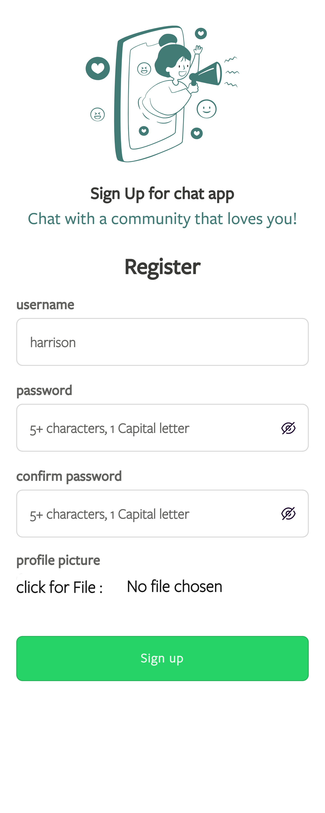

Most of all what i've built are either social media apps or features of common social media apps, and kind of makes me feel my niche is on building social media apps, cool!.

Currently working on the backend of a social media (A production project, not mine.) and with my period of working there, i've experienced this feeling of growth which is great, i now write a line of code after thinking of all use cases, considerations, e.t.c unlike this project (this is to be familiar with the socket.io library for websockets).

Stuff like system designs are now melody to my music, TDD are like the sounds, but most especially system designs which from my experience will advise every engineer to check out.

# My Xhat Project (Experience)

Like i had said earlier, this chat project is to make me get familiar with socket.io library and building some logic on how to make it work for my future projects and one thing i had missed in building this was the system designs.

## Issues with My Xhat (Frontend)

So My Xhat is broken to 2 parts offcourse the frotend and backend. The frontend is built with reactjs and the backend node.js.

My first mistake was while building the frontend, i personally chose to use vanilla codes, i.e html, css, js (jsx actually) and no 3rd party libraries/framework like materialize, chakra, e.t.c. Even to building the drop down notification feature like twitter's when you reply a comment or make a tweet, i coded them from scratch.

Issues where

- Adding to my much components and not time friendly
- Also couldnt code for every use case (case a, case b, case c, e.t.c coz it's just too much to handle)
- Also, i had poor management in managing my components especially for making it responsive. (Made a very bad decision by making components for desktop and mobile)
- Was just concentrated on the UI and not how it'll be responsive to the backend, the development, e.t.c

## My solutions for version 2

The solutions will just be try and correct those issues of course, so how?

- Will limit the number of components i create, use libraries for stuffs that have different multiple uses, for time and clean codes.
- Manage my state well, to work responsively with the backend (APIs)
- Dont just treat the frontend as just UI. make use of frameworks/libraries such as Materialize, bootstrap and chakra for responsive react components.

## Benefits of my experience

Aside all the bugs and all, i did learn some new things.

First of, when a user logs in, the user sends user data to the server, server creates a token and sends to the client for every authenticated request.
Managing state was hard even when i used context (which is not a state management tool BTW), coz initially the state will be null and when we update the context for the app, we will still need to mount our component with the useEffect hook and redirect to a homepage for users to make request. But still When users make request a first time after getting the token,the UI is mounted but not updated with the state so it sends the initial state in context which is `{token: null}`.

So my solution was to call the function in the useEffect only when there is an updated state i.e calling useEffect at the right time.

```javascript
import React, { useRef, useEffect } from "react";

const useDidMount = (func, dep) => {
  const didMount = useRef(false);

  useEffect(() => {
    if (didMount.current) {
      func();
    } else {
      didMount.current = true;
    }
  }, [dep]);
};

export default useDidMount;
```

then instead of calling the normal useEffect, we'll call

```Javascript

    useDidMount(() => {
        //codes
    }, dependencies)

    //This ensures the state in context now has user token in localstorage.

```

## Issues (Backend)

Tho the app has nice features, when a user request to chat with you, you have to accept first till then you won't the user chat (it'll look like the user is just chatting himself, got the idea from ladies who complain on not accepting "No"s).

So what are the issues?

- Of course, no system design, no design plan to atleast scale
- Messages will first have to be saved to the DB and wait for a 200 status code before passing through websockets to the other users.
- Data was'nt paginated from DB hence lots of data size on response (also causing slow response)
- Same to the notification.

## Solutions

For a solution, first thing first will be to research from other brilliant minds at tech giants (startups, unicorns, e.t.c as far as you are building stuff nice), and then

- Implement a system design to atleast scale, even if there are low cost to machines, e.t.c atleast the design should scale
- Messages should not be saved to the DB coz going through disk will cause a spending much time to get a message.
  So we'll integrate a caching tool and a popular one will be redis or maybe memcache.
- Let's choose redis, we'll save user messages to cache which is very fast and should work in miliseconds, then if successful, send through websockets (socket.io)
- Then implement a queuing system, something like bullJs to get all the messages to be saved in the DB
- Ensure we can retry if failed within some attempts.
- For the queue, data should be sent in batch, this will reduce hits on the DB server hence scaling that.
- For each message hash stored on redis, we'll expire them for redis to scale too.
- For the notifications, we'll add high those of priority to the DB and maybe use only cache for lesser ones or just pass through websockets.
- And also paginate both messages and notifications, if case cache does not contain data, we'll request the DB and atleast return it fast.

## Benefits

Hell yea, i learnt socket.io and loved it. Also gave me the opportunity to learn CORS aside from using it between SPA frontend and a backend.

## To run the project

```BASH
# backend
git clone <project url>
cd chat-app
#install the dependecies
npm install
# for the backend
npm run dev
# to get backend started at PORT 8000 with the mongoDB server (or atlas) setup and running
```

### for the frontend

```BASH
#frontend
cd chat-app/client
#install the dependencies
npm install
npm run start
# to get frontend (react.js) server running on default port 3000
```

That will be all, so anticipate for my version 2 which will include more and for that, i'll be hosting the version2. (Might even be on dark mode this time).

You can follow and chat me on twitter, handle is backendharry, same on linkedIn at backendharry or read some of my stuff at hashnode hashnode.dev/backendharry.
Happy coding!!

images of this version

- 
- 
- 
- 
- 
- 
- 
- 
- 
- 
